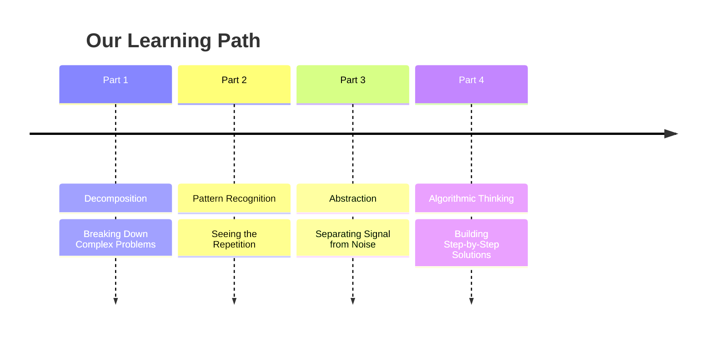

# The Core Challenge We Face

- You are experts in your domain—you understand buildings, structures, materials, and processes.
- Yet, we often find ourselves trapped in repetitive, manual work:
  - Manually checking door schedules against fire ratings
  - Counting light fixtures room-by-room
  - Extracting data from models cell-by-cell

 

**The Gap:** We have powerful software, but we're not fully leveraging its potential because we haven't learned to **think like problem-solvers** at a deeper level.

<!-- Presenter Notes:
Ask the audience: "How many of you have spent more than 2 hours this week on a task that felt like it could be automated or streamlined?" This gets them thinking about their own pain points.
-->
---
transition: slide-left
---

# What is Computational Thinking?

- It is **NOT** learning to code.
- It **IS** learning to solve problems the way a computer would—systematically, logically, and without ambiguity.
- It's a mental framework that applies whether you're using Excel, Revit, or just a pen and paper.

 

**The Four Pillars:**

1. 🧩 **Decomposition:** Breaking a complex problem into smaller parts.
2. 🔍 **Pattern Recognition:** Identifying similarities and trends.

3. 🎯 **Abstraction:** Focusing on what's important, ignoring what's not.
4. ⚙️ **Algorithmic Thinking:** Designing step-by-step solutions.

---
preload: false
---

# Lecture Roadmap (3-Hour Journey)

---

**Schedule:**
- 🕐 **Part 1 & 2:** 90 mins (with built-in activities)
- ☕ **Break:** 10 mins
- 🕒 **Part 3 & 4:** 90 mins
- ❓ **Q&A:** Final 15 mins
