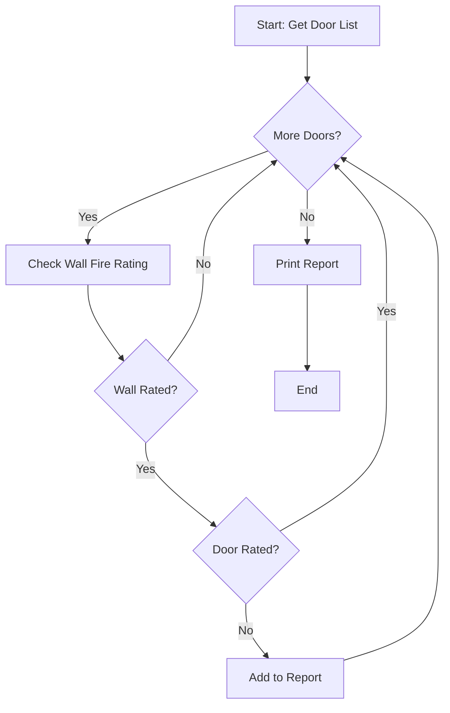

# Lecture 1: Foundations of Computational Thinking for AEC Professionals

**Instructor:** Jun Han
---
src: ./lesson1/intro.md
---
layout: two-cols
---

# Part 1: Decomposition
## Breaking Down Complex Problems

<v-click>

### The "Too Big" Problem

In construction, we face massive, overwhelming challenges:

- "Coordinate all MEP trades for the hospital project."
- "Ensure the entire building is code-compliant."
- "Generate a complete bill of materials for the tower."

</v-click>

<v-click>

**These problems are so large they paralyze us. Where do you even start?**

</v-click>

::right::

<v-click>

<div class="ml-4 p-6 bg-blue-50 rounded-lg">

### The Answer:

You don't solve the big problem. You **break it into smaller ones**.

> "The art of solving a problem is the art of breaking it into pieces small enough to solve."

</div>

</v-click>

<!-- Presenter Notes:
The two-column layout helps visually separate the problem (left) from the solution (right). Use this moment to let the tension build before revealing the answer.
-->

---
---

# What is Decomposition?

**Decomposition** is the process of breaking down a complex problem or system into smaller, more manageable parts.

- It's the "divide and conquer" strategy.
- Each smaller part can be understood, analyzed, and solved **independently**.
- Then, you assemble the solutions to solve the original big problem.

<br>

<div class="grid grid-cols-3 gap-2 text-center">
<div class="border-2 border-red-300 p-2 text-sm">Big Problem</div>
<div class="text-2xl">→</div>
<div class="border-2 border-green-300 p-2 text-sm">Small Part 1</div>
<div class="border-2 border-green-300 p-2 text-sm">Small Part 2</div>
<div class="border-2 border-green-300 p-2 text-sm">Small Part 3</div>
<div class="border-2 border-green-300 p-2 text-sm">Small Part 4</div>
</div>

---

# AEC Example: The Coordination Nightmare

**Big Problem:** "Coordinate all MEP services in the basement level."

1.  **Separate by Trade:**
    - Identify all HVAC clashes.
    - Identify all Plumbing clashes.
    - Identify all Electrical clashes.

2.  **Separate by Zone:**
    - Check clashes in Parking Zone A.
    - Check clashes in Parking Zone B.
    - Check clashes in Mechanical Room.

3.  **Separate by Priority:**
    - Identify hard clashes (physical interference).
    - Identify soft clashes (clearance/access issues).
<!--
This slide demonstrates how a paralyzing problem becomes a checklist of clear, actionable tasks.
-->

---
class: bg-green-50 p-8
---

# Activity 1: Decompose a Problem
**Time:** 15 mins

**Scenario:** You are the BIM manager for a 30-story mixed-use tower. The architect has just updated the **curtain wall system** on floors 10-20. You need to verify that all associated elements have been updated correctly.

<br>

**Task:** In pairs, decompose this big problem into at least **5 smaller, manageable sub-problems**.

<div class="grid grid-cols-2 gap-4 mt-6">
<div>

*Think about:*
- Structure
- Envelope
- Interiors
- MEP interfaces

</div>
<div class="border-l-2 border-gray-300 pl-4">

*Write your answers here:*
1. _______________________
2. _______________________
3. _______________________
4. _______________________
5. _______________________

</div>
</div>

---
---

# Activity 1 - Discussion

**What sub-problems did you identify?**

<div grid="~ cols-2 gap-4">

<div>
<v-click>

✅ Check that curtain wall mullions align with structural grid.

</v-click>
<v-click>

✅ Check that slab edges at floor 10 and 20 have been updated.

</v-click>
<v-click>

✅ Check that room floor-to-ceiling heights adjacent to curtain wall are still correct.

</v-click>
</div>

<div>
<v-click>

✅ Check that exterior shading devices are still attached correctly.

</v-click>
<v-click>

✅ Check that door swings in curtain wall don't interfere with structure.

</v-click>
<v-click>

✅ Verify that window washing anchors are still positioned correctly.

</v-click>
</div>
</div>

<br>
<v-click>

> **Key Insight:** There is no single "right" answer—good decomposition is about **logical separation**.

</v-click>

---
transition: slide-up
---

# Part 2: Pattern Recognition
## Seeing the Repetition

<br>

### What is Pattern Recognition?

**Pattern Recognition** is the process of identifying similarities, trends, and regularities in data or problems.

- Once you've decomposed a big problem, you often notice that many of the smaller pieces **look alike**.
- Recognizing patterns allows you to solve similar problems the **same way**, saving enormous time and effort.

> "Pattern recognition is the mother of all efficiency."

---
---

# Patterns in Construction - Examples

<div class="grid grid-cols-3 gap-4 mt-4">
<div class="border rounded-lg p-4 shadow">
<h3 class="text-lg font-bold">📋 In Schedules</h3>
<ul class="text-sm">
<li>All doors have properties (width, height, material, fire rating)</li>
<li>All rooms have properties (area, number, name)</li>
<li>All columns have properties (size, material, elevation)</li>
</ul>
</div>

<div class="border rounded-lg p-4 shadow">
<h3 class="text-lg font-bold">📐 In Details</h3>
<ul class="text-sm">
<li>Typical wall connections repeat</li>
<li>Window head/jamb/sill details repeat</li>
<li>Stair details repeat with slight variations</li>
</ul>
</div>

<div class="border rounded-lg p-4 shadow">
<h3 class="text-lg font-bold">🔄 In Processes</h3>
<ul class="text-sm">
<li>Submittal review follows same steps</li>
<li>RFI logging follows same workflow</li>
<li>Change order processing follows same pattern</li>
</ul>
</div>
</div>

---
---

# AEC Example: The Hotel Project Pattern

**Scenario:** You are working on a 20-story hotel. Floors 3-18 are identical guest room floors.

<br>

| Approach | Work Required | Risk |
|:---------|:--------------|:-----|
| **Without Pattern Recognition** | Design, document, and check each floor individually = **15x the work** | High (inconsistencies likely) |
| **With Pattern Recognition** | Design and document **one** typical floor; apply to all 15 | Low (spot-check only) |

<br>

<div class="p-4 bg-blue-100 rounded-lg">

**Result:** 80% reduction in work. 🎯

</div>

<!--
This is a powerful example because every AEC professional has encountered a repetitive building type. The pattern here is "typical floor" - once recognized, it transforms your workflow.
-->

---
---

# Recognizing Patterns in Problems

Patterns aren't just in the building—they're in the **problems** we solve.

**Example Problem Pattern:** "I need a list of all **X** where condition **Y** is true."

<div class="grid grid-cols-2 gap-2 text-sm mt-4">
<div class="border p-2">✅ "I need a list of all **doors** where **fire rating is less than 1 hour**."</div>
<div class="border p-2">✅ "I need a list of all **rooms** where **area is less than minimum required**."</div>
<div class="border p-2">✅ "I need a list of all **beams** where **depth exceeds 600mm**."</div>
<div class="border p-2">✅ "I need a list of all **sheets** where **revision date is blank**."</div>
</div>

<br>

**Recognize the pattern?** The problem structure is identical. Only the specific details (X and Y) change.

---
---

# Activity 2: Find the Pattern

**Scenario:** You are reviewing the following list of RFIs. Identify any patterns you see.
<Transform :scale="0.7" origin="top left">

| RFI # | Discipline | Subject | Status |
|-------|------------|---------|--------|
| 001 | Structural | Column base plate connection detail | Closed |
| 002 | Architectural | Curtain wall anchor embeds | Open |
| 003 | Structural | Beam penetration for MEP | Closed |
| 004 | MEP | Duct clearance above corridor | Open |
| 005 | Structural | Column splice location | Open |
| 006 | Architectural | Storefront anchorage | Closed |
| 007 | Structural | Beam web openings | Open |
| 008 | MEP | Pipe support spacing | Closed |

**Questions:**
1. What patterns do you see in the data?
2. How could recognizing these patterns help you manage the RFI process more efficiently?

</Transform>

---
---


# Activity 2 - Discussion

**Patterns you might have found:**
<Transform :scale="0.7" origin="top left">
<div class="grid grid-cols-2 gap-4">

<div>
<v-click>

**By Discipline:**
- Structural RFIs (001, 003, 005, 007) are the most numerous.
- Maybe structural documents need more review.

</v-click>
</div>

<div>
<v-click>

**By Subject:**
- RFIs about "connections/anchorage" (001, 002, 006) appear across disciplines.
- Maybe there's a coordination issue at connections.

</v-click>
</div>

<div>
<v-click>

**By Status:**
- Open RFIs (002, 004, 005, 007) are split across disciplines.
- Structural has the most open items.

</v-click>
</div>
</div>

<v-click>

**How this helps:**
- Assign all structural RFIs to the structural engineer.
- Schedule a meeting focused on "connections" to resolve multiple RFIs at once.
- Prioritize chasing open structural RFIs.

</v-click>
</Transform>
---
---

# ☕ Break Time (10 mins)

<div class="flex justify-center items-center h-64">
<div class="text-center p-8 bg-amber-50 rounded-2xl shadow-lg">

## Stretch your legs.
## Grab a coffee.

**We'll reconvene in 10 minutes for Part 3: Abstraction.**

</div>
</div>

<!--
This slide uses a simple centered layout with styling to create a clear visual break.
-->

---
---

# Part 3: Abstraction
## Separating Signal from Noise

<br>

### What is Abstraction?

**Abstraction** is the process of filtering out unnecessary details to focus on what's important.

- It's about creating a **simplified model** of a complex reality.
- It answers the question: "What is the **essence** of this problem?"

> "The map is not the territory." — Alfred Korzybski

---
layout: image-right
image: https://images.unsplash.com/photo-1569336415962-a4c11fba3751?q=80&w=1931&auto=format&fit=crop
---

# Abstraction in Everyday Construction

- **A drawing set** is an abstraction of the real building. It doesn't show every bolt or speck of dust.
- **A schedule** is an abstraction. It lists door properties but doesn't show what the door looks like.
- **A BIM model** is an abstraction. It has parameters and geometry, but not chemical composition.

**Abstraction is about deciding what to include and what to leave out.**

---
---

# AEC Example: The Wall Abstraction

<div class="grid grid-cols-2 gap-8 mt-4">
<div>

### In reality, it contains:
- Concrete mix design details
- Reinforcement bar sizes and spacing
- Embedded items (conduits, sleeves)
- Surface texture
- Curing history
- Actual construction date
- Crew who built it
- Weather during pouring

</div>
<div class="border-l-2 border-gray-300 pl-8">

### In your model (the abstraction), it contains:
- ✅ Length
- ✅ Width
- ✅ Height
- ✅ Material
- ✅ Fire rating

**The abstraction is useful because it contains only what you need for design and coordination.**

</div>
</div>

---
---

# Generalization - The Power of Abstraction

Abstraction allows us to **generalize** solutions.

| Specific Problem | Abstracted Problem |
|:-----------------|:-------------------|
| "Find all **hollow metal doors** that are **36" wide** on **Floor 2**." | "Find all **[elements]** that match **[criteria A]** and **[criteria B]** in **[location]** ." |

<br>

**Once abstracted, you can apply the same thinking to:**

- Find all **concrete columns** that are **24"x24"** on **Floor 5**.
- Find all **diffusers** that are **24"x24"** in **Room 101**.
- Find all **windows** that are **operable** on the **North elevation**.

---
---

# Activity 3: Create an Abstraction
**Time:** 15 mins

**Scenario:** You have been asked to perform the following three tasks:

1. Find all rooms in the **hospital** that are less than **10m²** (too small for their intended use).
2. Find all doors in the **office tower** that are less than **900mm wide** (non-compliant with accessibility).
3. Find all beams in the **parking structure** that are less than **300mm deep** (potentially under-designed).

<br>

**Task:**
- What is the **abstracted version** of this problem?
- What are the **essential elements** you need to describe it generally?

---
---

# Activity 3 - Discussion

**The Abstraction:**

<div class="text-center p-6 my-6 bg-yellow-50 rounded-xl text-xl font-bold">
"I need to find all **[elements]** in **[location]** where **[property]** is less than **[threshold value]** ."
</div>

**Essential Elements:**
1. The **type of element** to check (rooms, doors, beams)
2. The **location** to search (hospital, office tower, parking structure)
3. The **specific property** to evaluate (area, width, depth)
4. The **threshold value** for comparison (10m², 900mm, 300mm)
5. The **comparison operator** (less than, greater than, equal to)

<br>

> **Why this matters:** You've moved from solving one specific problem to solving a whole **class** of problems.

---
---

# Part 4: Algorithmic Thinking
## Building Step-by-Step Solutions

<br>

### What is Algorithmic Thinking?

**Algorithmic Thinking** is the ability to define clear, step-by-step procedures for solving a problem.

- It's the bridge from thinking to **doing**.
- It answers the question: "If I know WHAT needs to be done (abstraction), what are the EXACT STEPS to do it?"

An **algorithm** is simply a sequence of unambiguous instructions.

---
---

# You Already Use Algorithms

<div class="grid grid-cols-2 gap-6">
<div>

### Morning Routine Algorithm:
```
1. Wake up
2. IF weekday, go to step 3
   ELSE go back to step 1
3. Take a shower
4. Get dressed
5. Eat breakfast
6. IF time < 8:00 AM
      Drive to work
   ELSE
      Call office
7. End
```

</div>
<div>

### Pouring Concrete Algorithm:
```
1. Check weather
2. Inspect formwork
3. Order concrete
4. Begin pour at farthest corner
5. Vibrate within 15 min
6. Screed surface
7. Begin finishing
```

</div>
</div>

---
---

# The Three Pillars of Algorithmic Thinking

<div class="flex justify-around my-8">
<div class="text-center p-4">
<div class="text-5xl mb-2">1️⃣</div>
<h3>Sequence</h3>
<p class="text-sm">Steps in correct order</p>
<p class="text-xs text-gray-500">(Frame before drywall)</p>
</div>

<div class="text-center p-4">
<div class="text-5xl mb-2">2️⃣</div>
<h3>Decision</h3>
<p class="text-sm">IF/THEN choices</p>
<p class="text-xs text-gray-500">(If raining, stop work)</p>
</div>

<div class="text-center p-4">
<div class="text-5xl mb-2">3️⃣</div>
<h3>Repetition</h3>
<p class="text-sm">Repeat steps</p>
<p class="text-xs text-gray-500">(FOR EACH floor, pour slab)</p>
</div>
</div>

---
---

# AEC Example: The Door Check Algorithm

**The Task:** Review all doors in a floor and flag any that are missing required fire ratings.
<Transform :scale="0.4" origin="top center">

</Transform>

---
---

# The Algorithm in Pseudocode

```
Step 1: Get the complete list of doors for Floor 3.
Step 2: Start with the first door in the list.

Step 3: Check if this door is in a fire-rated wall.
    IF the wall has a fire rating, THEN go to Step 4.
    IF the wall has no fire rating, go to Step 6.

Step 4: Check if the door has a fire rating.
    IF the door has a fire rating, go to Step 6.
    IF the door has NO fire rating, go to Step 5.

Step 5: Add this door to the "Missing Fire Rating" report.

Step 6: Move to the next door in the list.
    IF there is another door, go back to Step 3.
    IF there are no more doors, go to Step 7.

Step 7: Print the "Missing Fire Rating" report.
```

<!--
Notice we didn't write a single line of actual computer code. We used pseudocode—a plain-language description of the steps.
-->

---
---

# Another Algorithm: Quantity Verification

**Task:** Verify that the total quantity of concrete in the model matches the quantity ordered.

```
ALGORITHM VerifyConcreteQuantities

    INPUT: Model elements, OrderedVolume
    OUTPUT: Discrepancy report
    
    SET TotalVolume = 0
    
    FOR EACH concrete element IN model
        GET element dimensions
        CALCULATE element.volume = length × width × height
        ADD element.volume TO TotalVolume
    NEXT element
    
    SET Difference = TotalVolume - OrderedVolume
    
    IF Difference > 0.05 × OrderedVolume THEN
        PRINT "Warning: Quantity discrepancy detected!"
        PRINT "Difference: " + Difference
    ELSE
        PRINT "Quantities are within acceptable tolerance."
    END IF
    
END ALGORITHM
```

---
---

# Activity 4: Write an Algorithm
**Time:** 20 mins

**Scenario:** You are responsible for room data sheets. You have a list of 50 rooms. You need to check if any room's "Area" is less than the "Minimum Area" required by the building code. If it is, you must mark it as "Non-Compliant."

<br>

**Task:** Write a step-by-step algorithm (in pseudocode) to accomplish this task.

<div class="grid grid-cols-2 gap-4 mt-4">
<div class="bg-gray-50 p-4 rounded">

*Think about:*
- What data do you need to start?
- What decisions need to be made?
- Does anything need to be repeated?
- What is the final output?

</div>
<div class="border-2 border-dashed border-gray-400 p-4 rounded font-mono text-sm">

```
YOUR ALGORITHM:


```
</div>
</div>

---
---

# Activity 4 - Sample Solution

```
Step 1: Get the list of all rooms from the schedule.

Step 2: Create an empty list called "NonCompliantRooms."

Step 3: For each room in the list:

    Step 3a: Get the room's actual "Area" value.
    
    Step 3b: Determine the room's "Minimum Required Area" 
             based on its function.
    
    Step 3c: Compare the actual area to the minimum.
        IF actual area < minimum required area THEN:
            Add the room name to "NonCompliantRooms."
        ELSE:
            Do nothing (room is compliant).
    
    Step 3d: Move to the next room.

Step 4: After checking all rooms, check if "NonCompliantRooms" is empty.
    IF it is empty THEN:
        Print "All rooms are compliant."
    ELSE:
        Print "The following rooms are non-compliant:"
        For each room in "NonCompliantRooms":
            Print the room name.

Step 5: End.
```

---
---

# Bringing It All Together

The four pillars work together as a complete problem-solving framework:

| Pillar | Question It Answers | AEC Example |
|:-------|:--------------------|:------------|
| **Decomposition** | What are the pieces? | Break "coordinate hospital" into trades, zones, systems |
| **Pattern Recognition** | What looks familiar? | Notice that floors 3-18 are identical |
| **Abstraction** | What is the essence? | Generalize "door check" to "element check" |
| **Algorithmic Thinking** | What are the steps? | Write the step-by-step procedure |

---
layout: center
class: text-center
---

# Why This Matters for Your Career

<div class="grid grid-cols-2 gap-4 mt-8 text-left">
<div>

**✅ Efficiency:** Solve problems faster by recognizing patterns.

**✅ Quality:** Fewer mistakes with clear algorithms.

**✅ Communication:** Explain your thinking to colleagues.

</div>
<div>

**✅ Leadership:** Become the person who figures out *how* work should be done.

**✅ Adaptability:** These skills transfer across software, projects, and roles.

</div>
</div>

<br>
<br>

> "The most valuable worker of the future won't be the one who knows how to use the most tools, but the one who knows how to think about the most problems."

---
---

# Summary & Key Takeaways

- **Computational Thinking is a mindset**, not a technical skill.
- **Decomposition:** Break big problems into small, solvable pieces.
- **Pattern Recognition:** Find similarities to avoid reinventing the wheel.
- **Abstraction:** Focus on what's essential; ignore what's not.
- **Algorithmic Thinking:** Create clear, step-by-step procedures.
- These skills work together to make you a more effective problem-solver in any AEC role.

---
class: bg-blue-50 p-8
---

# Your Challenge Going Forward

For the next week, practice computational thinking in your daily work:

<div class="grid grid-cols-2 gap-4 mt-6">
<div class="bg-white p-4 rounded shadow">

### 🧩 Decomposition
When faced with a complex task, break it into at least **5 smaller tasks** before starting.

</div>
<div class="bg-white p-4 rounded shadow">

### 🔍 Pattern Recognition
Look for **patterns** in the RFIs, submittals, or change orders you process.

</div>
<div class="bg-white p-4 rounded shadow">

### 🎯 Abstraction
Ask: "What is the **abstraction** here? What type of problem is this really?"

</div>
<div class="bg-white p-4 rounded shadow">

### ⚙️ Algorithmic Thinking
Before executing a multi-step process, **write down the steps** and see if you can improve them.

</div>
</div>


---
layout: end
---

# Thank You!

### Questions?

**Contact Information:**
- han@aec-tech.net
- 92259668